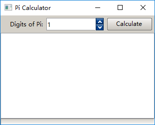

# Nana Handbook
2017 Nana C++ Library Developer Community

This documentation introduces some basic knowledges about rapid GUI programming with Nana C++ Library.

Now let's get started!

## Table of Contents

[INTRODUCTION](#introduction)

  * [Why is Modern C++?](#why-is-modern-c)
  * [Hello World!](#hello-world)
  * [Event Handling](#event-handling)
  * [Basic Structure of Application](#basic-structure-of-application)
  * [Multithreaded GUI](#multithreaded-gui)

[PRACTICES](#practices)
  * [Pi Calculator](#pi-calculator)

# INTRODUCTION
Nana is a cross-platform library written in modern C++, which is designed to make things simple and intuitive.

## WHY IS MODERN C++?
By "Modern C++" we mean C++11/14/17, the philosophy of modern C++ is to write simple and intuitive code using modern C++ features:

  * RAII
  * Standard library
  * Templates and metaprogramming
  * Exceptions

Resource acquisition is initialization(RAII) is an important technique of C++, it reduces a huge complexity for the application of Nana. For a developer, he would not take care about how a Nana class acquires/releases resource and also don't warry about the resource leak when an exception is thrown.

The standard library is used not only the internal implementation of Nana but also in the design of programming interfaces. Smart pointers and containers used for the return value type and parameter types greatly reduce the complexity of memory management. For example, passing multi values with an intializer-list to a function that parameter is a container.

Templates and metaprogramming have nature ability for library design. By using these techniques, it is possible to make more general and intuitive interfaces/functions/class. For example, Nana's event handler is designed to have a parameter to receive the event argument, but developers can pass a function without the parameter to the event register when they want to ignore the event argument.

Using exceptions for error handling makes library simpler, cleaner and less likely to miss errors. It is safe because of RAII.


## HELLO WORLD!

A traditional HelloWorld program in C++ book is looked like this

```cpp
#include <iostream>

int main()
{
	std::cout << "Hello World!" << std::endl;
}
```

It sends the text "Hello World!" and a newline/line flush(endl) to the console for output and display.

Now, let's start 3 HelloWorld examples with Nana. Each example displays the text "Hello World!" with different functions.

### EXAMPLE 1

Display "Hello World!" by popping up a message box.

```cpp
//It instructs the compiler to include the core part of Nana,
//this header file contains some class and function definitions.
#include <nana/gui.hpp>

int main()
{
	//A message box object is created, titiled "Example".
	nana::msgbox msg{"Example"};

	//Sends the text "Hello World!" to the message box
	//output buffer.
	msg << "Hello World!";

	//Pops up a messagebox. The `show()` blocks the execution
	//until the message box is closed.
	msg.show();
}
```
>Q: Why does Nana provide a class for the message box rather than a function like Win32 MessageBox?

>A: Because the class msgbox is designed to be a function object. Following example illustrates the msgbox to be used as a handler that pops up a message box when form is clicked.
>
>```cpp
>#include <nana/gui.hpp>
>
>int main()
>{
>	nana::form fm;
>	fm.events().click(nana::msgbox{fm, "Example"}<<"The form is clicked");
>	fm.show();
>	nana::exec();
>}
>```

### EXAMPLE 2

Create a form and a label widget, the label displays the text "Hello World!". A form is a popup window.

```cpp
#include <nana/gui.hpp>

//Includes the label header
#include <nana/gui/widgets/label.hpp>

int main()
{
	//Brings all nana names into main scope.
	using namespace nana;

	//Create a form.
	form fm;

	//Create a label on the form, at position (1, 20) with size 100x30
	label lb{fm, rectangle{10, 20, 100, 30}};

	//Show the text "Hello World!"
	lb.caption("Hello World!");

	//Show the form
	fm.show();

	//where main() passes the control to Nana, and exec() will return
	//if the form is closed.
	exec();
}
```

This example also shows a basic structure of Nana's application. Prepare at least one form object, then call `exec()`. The `exec()` listens for a user input and dispatches the input to correspending modules for processing.

### EXAMPLE 3

This example shows the text "Hello World!" by drawing the text on a form.

```cpp
#include <nana/gui.hpp>

int main()
{
	//Brings all nana names into main scope.
	using namespace nana;

	//Create a form.
	form fm;

	//Draws text "Hello World!" on the form.
	drawing{fm}.draw([](paint::graphics& graph){
		graph.string({ 10, 20 }, "Hello World!", colors::black);
	});

	//Shows the form
	fm.show();

	//where main() passes the control to Nana, and exec() will return
	//if the form is closed.
	exec();
}
```

Draws the text directly on the surface of form. The class `drawing` is set a drawer to the specified widget and the drawer will be invoked everytime the widget refreshes.

## EVENT HANDLING

An event describes the change in state of UI object. For example: pressing a button, entering a character in textbox, etc. Any program that uses Nana is event driven. After the UI objects are created, the program passes the control to the event loop and listens for events, and then triggers a callback function when one of those events is raised.

The event handling in Nana is dynamic event handling. It allows program to install a new event handler or to uninstall an existing event handler in runtime.

```cpp
#include <nana/gui.hpp>
#include <iostream>

int main()
{
	using namespace nana;

	form fm;
	fm.show();

	fm.events().click([]{
		std::cout<<"The form is clicked"<<std::endl;
	});

	exec();
}
```

In this example, the program sends the text `"The form is clicked"` to the console for display when the form is clicked.

## BASIC STRUCTURE OF APPLICATION

A normal Nana application contains two main elements:

  * A form
  * An event loop

```cpp
#include <nana/gui.hpp>

int main()
{
	nana::form fm;
	fm.show();

	nana::exec();
}
```

In the above example we showed a very basic Nana application, which creates a form and starts an event loop.

When the program runs, it shows a window, but it doesn't exit immediately. Because the `nana::exec()` starts an event loop and blocks the execution of `main()` function. In `nana::exec()`, Nana receives and processes user and system events and passes these on to the appropriate widgets.

`nana::exec()` will return when the form is closed. If we define multiple forms, `nana::exec()` will return when all forms are closed.

>Q: Why doesn't Nana have a main window feature that closing the main window causes the application to shutdown?

>A: The answer to the question from 2 aspects.
>
>* The Nana is a library, not a framework. Nana doesn't take over the startup and exit of the control of the program, unlike frameworks, the entry of program is a framework defined entry, not C++ `main()` entry. So returning `nana::exec()` doesn't mean to shutdown the program. 
>
>* Nana supports multithreading, developer can start a new thread for GUI. The main window feature will increase design complexity in multithreaded environment, it also brings the complexity that makes developers write error-prone code.

Let's take a look at another example

```cpp
#include <nana/gui.hpp>

nana::form fm;

int main()
{
	fm.show();
	nana::exec();
}
```

The program is incorrect event though it contains 2 main elements. The behavior of initialization of the global variable `fm` is undefined, because the initialization of `fm` depends on the internal library data and resources, the orders of initialization of `fm` and the initialization of internal library data are unspecified.

Consequently, all Nana widgets should never be declared as global variables.

## MULTITHREADED GUI

Many GUI frameworks require all GUI objects to be accessed exclusively by the UI thread. If a GUI object is accessed from a non-UI thread, an invalid thread access error occurs and the whole application may abort. Nowadays, the multithreading paradigm has become more popluar, using a tradditional GUI frameworks in multithreadeded environment will introduce many software design/architecture problems, working around this and having all GUI objects created in one UI thread would be rather messy.

Nana is designed to support multithreading, a multithreaded GUI can make the program architecture more flexible. More than that, Nana also minimizes the complexity of writing a multithreaded GUI. There is a little difference between multithreading and single-thread in structure.

```cpp
#include <nana/gui.hpp>
#include <thread>

int main()
{

	using namespace nana;

	form fm;
	fm.show();

	std::thread thr{ [] {
		form thr_fm;
		thr_fm.show();

		exec();
	} };

	exec();

	thr.join();
}
```

In the above example, we created 2 form in different threads. The `exec()` must be called for each thread, it creates separate event loops for each thread.

Now, let's look at the multithreaded UI interaction.

```cpp
#include <nana/gui.hpp>
#include <nana/gui/widgets/button.hpp>
#include <nana/gui/widgets/label.hpp>
#include <thread>

int main()
{
	using namespace nana;

	form fm;
	label lbl{ fm, rectangle{10, 10, 180, 24} };

	std::thread thr{ [&] {
		form thr_fm;
		button thr_btn{ thr_fm, rectangle{10, 10, 100, 24} };

		thr_btn.caption("Say Hello");
		thr_btn.events().click([&] {
			lbl.caption("Hello from another thread");
		});

		thr_fm.show();

		exec();
	} };

	fm.show();

	exec();

	thr.join();
}
```

In the above example, a label was created on the form which is created by `main()` function, and a button was created on the form which is in another thread. When the button get clicked, it sends the text `"Hello from another thread"` to the label for output and display.

# PRACTICES

## Pi CALCULATOR

This chapter intends to illustrate how to create a Pi(π) calculator step by step.

Create the UI

```cpp
#include <nana/gui.hpp>
#include <nana/gui/widgets/label.hpp>
#include <nana/gui/widgets/spinbox.hpp>
#include <nana/gui/widgets/button.hpp>
#include <nana/gui/widgets/textbox.hpp>
#include <nana/gui/widgets/progress.hpp>

int main()
{
	using namespace nana;

	form fm;
	fm.caption("Pi Calculator");

	label lab{ fm, "Digits of Pi:" };
	lab.text_align(align::right, align_v::center);
	
	spinbox spin{fm};
	spin.range(1, 9000000, 1);

	button btn{ fm };
	btn.caption("Calculate");

	textbox txt{ fm };
	txt.editable(false);
	txt.enable_caret();

	progress prg{ fm };

	
	fm.div("vert <weight=35 margin=5 arrange=[80,variable, 90] gap=7 conf><text><weight=12 progress>");
	fm["conf"] << lab << spin << btn;
	fm["text"] << txt;
	fm["progress"] << prg;
	fm.collocate();
	
	fm.show();

	exec();
}
```


The UI contains a spinbox for selecting the digits of Pi, a button for starting calculation, a textbox for displaying Pi and a progress bar for the progress of calculation.

Now, let's implement the function of pi calculation.

```cpp
template<typename Progress>
std::string calc_pi(std::size_t digits, Progress progress)
{
	std::string pi = "3.";
	for (std::size_t i = 0; i < digits; i += 9) {
		//Implementation of Pi algorithm
		//...
		progress(digits_calculated);
	}
	return pi;
}
```

`calc_pi()` has 2 parameters, the first parameter specifies the number of digits of Pi will be generated, the second parameter is a function object used for informing the UI to update the progress. The return value of `calc_pi()` is the generated Pi.

Now, let's integrate the `calc_pi()` into the Pi Calculator program.

```cpp
int main()
{
	using namespace nana;

	//...

	progress prg{ fm };

	//Let's put the code here
	btn.events().click([&]{
		btn.enabled(false);

		auto digits = spin.to_int();

		prg.amount(digits);
		prg.value(0);

		auto pi = calc_pi(digits, [&](std::size_t calculated_digits){
			prg.value(calculated_digits);
		});

		txt.caption(pi);

		btn.enabled(true);
	});

	
	fm.div("vert <weight=35 margin=5 arrange=[80,variable, 90] gap=7 conf><text><weight=12 progress>");
	
	//..

	exec();
}
```

The program starts to calculate the Pi when the button(`btn`) is clicked. Let's take a look at the `click handler` for the button. Before calculating, we need to **disable** the button for avoiding a user clicking the button during the Pi calculation. The max value of progress bar is equal to the number of digits that the program will generated for Pi. Then, call `calc_pi()` for generating the n-th digits of Pi. A function created by the lambda is passed to the second parameter of the `calc_pi()`, the lambda updates the progress bar during calculation. When the calculation finishes, the Pi is sent to text for display. In the end, enables the button.

### PREVENT UI FROM FREEZING DURING LONG-RUNNING OPERATIONS

Let's compile this program and run it. We will see the Pi in the textbox. But if a big number is inputted for the digits of Pi, the UI will freeze during Pi calculation. To create a responsive UI, the long-running operation need to be executed asynchronously, meaning that rather than blocking the thread calling event handler from returning to the event loop until the operation has completed. Let's address this issue.

```cpp
//#include ...
#include <future>

int main()
{
	using namespace nana;

	//...

	progress prg{ fm };

	std::future<void> pi_future;

	//Let's put the code here
	btn.events().click([&]{
		pi_future = std::async(std::launch::async, [&]{
			btn.enabled(false);

			auto digits = spin.to_int();

			prg.amount(digits);
			prg.value(0);

			auto pi = calc_pi(digits, [&](std::size_t calculated_digits){
				prg.value(calculated_digits);
			});

			txt.caption(pi);

			btn.enabled(true);
		}
	});

	
	fm.div("vert <weight=35 margin=5 arrange=[80,variable, 90] gap=7 conf><text><weight=12 progress>");
	
	//..

	exec();
}
```

The program runs the Pi calculation job asynchronously by using `std::async()`. The object `pi_future` is used for holding the return value of `std::async()` in order to prevent from destructing the temporary `std::future` object returned by `std::async()`, otherwise, the destruction of the temporary `std::future` blocks the execution of click event handler.

Run the program again, and input a larger digits of Pi. We will see a responsive UI during Pi calculation. Now the asynchronous calculation brings a new issue, When the Pi calculation is working, the process doesn't terminated even though the UI is closed. It's unexpected, we need to fix the issue. The reason for the issue is that the Pi calculation hasn't finished yet.

```cpp
template<typename Progress>
std::string calc_pi(std::size_t digits, Progress progress)
{
	std::string pi = "3.";
	for (std::size_t i = 0; i < digits; i += 9) {
		//Implementation of Pi algorithm
		//...

		//Stop calculating if progress returns false
		if(!progress(digits_calculated))
			return {};
	}
	return pi;
}

//#include ...
#include <future>
#include <atomic>

int main()
{
	using namespace nana;

	//...

	progress prg{ fm };

	std::future<void> pi_future;

	//A flag indicates the form is unloading.
	std::atomic<bool> unloaded{false};

	//Let's put the code here
	btn.events().click([&]{

		//Move this statement out of the std::async's function.
		//Because the button is used to check the status of
		//calculation in unload event handler.
		btn.enabled(false);

		pi_future = std::async(std::launch::async, [&]{

			auto digits = spin.to_int();

			prg.amount(digits);
			prg.value(0);

			auto pi = calc_pi(digits, [&](std::size_t calculated_digits){
				prg.value(calculated_digits);

				//Stop calculating when form is going to closed.
				return !unloaded.load();
			});

			txt.caption(pi);

			btn.enabled(true);
		}
	});

	fm.events.unload([&]{
		//It indicates the calculation is working if button
		//is disabled.
		if(false == btn.enabled())
		{
			unloaded = true;

			internal_revert_guard irg; //This is important
			pi_future.wait();
		}
	});

	
	fm.div("vert <weight=35 margin=5 arrange=[80,variable, 90] gap=7 conf><text><weight=12 progress>");
	
	//..

	exec();
}
```

In the form unload event handler, we set the flag `unloaded` to inform the calculation, then call `pi_future.wait()` to wait for the calculation.

The `internal_revert_guard irg;` is important, because `pi_future.wait()` will block the execution of the calling thread, the calling thread has acquired the `internal library mutex`, when `calc_pi()` exits, the job will update the textbox and enable the button in other thread, these operations all require to acquire the `internal library mutex`. Without `internal_revert_guard irg;`, a deadlock occurs.

The class `internal_revert_guard` is useful for Nana multithreaded programming. When a thread is going to perform a wait operation, but it has acquired the `internal library mutex`, the `internal_revert_guard` should be performed before a wait opertion, it is used for releasing the `internal library mutex` when it is constructing, after the wait operation finished, destructs the `internal_revert_guard`, it will automatically acquire the `internal library mutex` as the state before it constructed.